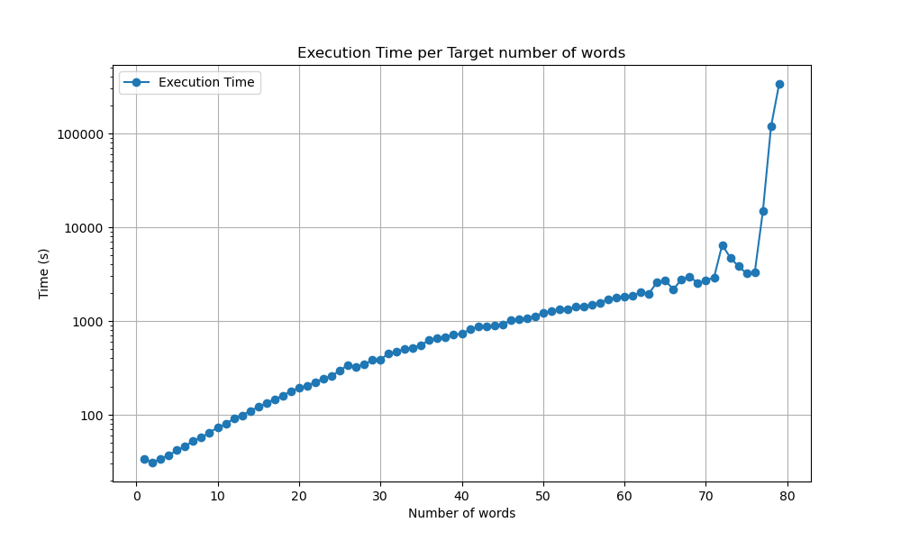

# SAT solver encoder for Word Design for DNA Computing on Surfaces

In this repository, you can find a solution for the CSPlib problem 033
called "Word Design for DNA Computing on Surfaces". It utilizes CNF
to encode constraints, which can then be fed into a SAT solver (eg. glucose-syrup).

## The problem

Copied from https://www.csplib.org/Problems/prob033/.

Find as large a set $S$ of strings (words) of length 8 over the alphabet
$W = \{A, C, T, G\}$ with the following properties:

1. Each word in $S$ has 4 symbols from $\{C,G\}$.
2. Each pair of distinct words in $S$ differ in at least 4
   positions.
3. Each pair of words $x$ and $y$ in $S$ are such that $x^R$ and $y^C$
   differ in at least 4 positions. Here, $(x_1,...,x_8)^R = (x_8,...,x_1)$
   and $y^C$ is the Watson-Crick complement of $y$.

## Encoding

### Each position must contain exactly one letter

For every word $i$ and position $j$:

- At least one letter
  - $\bigvee_{l \in W} x_{i,j,l}$
- At most one letter
  - $\neg x_{i,j,l_1} \vee \neg x_{i,j,l_2}$ for all distinct letters $l_1, l_2 \in W$

### Each word must have exactly four letters from $\{C,G\}$

For every word $i$

- We define variables $cg_{i,j}$ and $not\_cg_{i,j}$ that indicate that in the $i$-th word on the $j$-th position, there is or is not a $C$ or a $G$.
  - $cg_{i,j} \iff x_{i,j,C} \vee x_{i,j,G}$
  - $not\_cg_{i,j} \iff x_{i,j,A} \vee x_{i,j,T}$
- Exactly four $C$ and $G$ means
  - At most four $C$ and $G$
    - $\bigwedge_{S \subset \{1,2,...,8\}, |S| = 5} \neg cg_{i,j_1} \vee ... \vee \neg cg_{i,j_5}$
  - At most four $A$ and $T$
    - $\bigwedge_{S \subset \{1,2,...,8\}, |S| = 5} \neg not\_cg_{i,j_1} \vee ... \vee \neg not\_cg_{i,j_5}$

### Each pair of distinct words has to differ in at least 4 positions

For each two distinct words $i,k$ and position $j$

- We define variables $same_{i,k,j}$, which indicate that $j$-th position of $i$ and $k$ are the same.
  - $same_{i,k,j} \iff \bigvee_{l \in W} x_{i,j,l} \wedge x_{k,j,l}$
- Differ at least 4 positions can now be encoded like
  - $\bigwedge_{S \subset \{1,2,...,8\}, |S| = 5 } \neg same_{i,k,j_1} \vee ... \vee \neg same_{i,k,j_5}$

### Reverse of one word and complement of another differ in at least 4 positions

- We define variables
  - $comp_{i,k,j} \iff \bigvee_{l \in W} x_{i, 8 - j + 1, l} \wedge x_{k,j,c(l)}$, where $c(l)$ gives us the complement base
    to the letter $l$.
- The constraint is now be encoded like
  - $\bigwedge_{S \subset \{1,2,...,8\}, |S| = 5} \neg comp_{i,k,j_1} \vee ... \vee \neg comp_{i,k,j_5}$

### Possible improvements

It'd be possible to encode the atomic variables $x_{i,j,l}$ differently. Instead of not having four variables per letter, we would have two (we need two bits to encode information about four letters). I tried to implement this but ultimately failed, so I reverted to this more straightforward encoding.

## Usage

```
./word_design.py [-h] [-s SOLVER] [--verbose] [--validate] number_of_words
```

Use `./word_design.py --help` for more information.

The `number_of_words` argument is the size of $S$ ($|S|$) we are trying
to solve for.

## Benchmarking

The experiment was done on an AMD Ryzen 7 7840U (3.3 GHz, 8x2 threads) and 64 GB of RAM running Arch Linux.

## Time per number of words

All these cases were satisfiable. After the last attempt, the time to solve
was just way to high.

| Number of words | Time (ms) |
| --------------- | --------- |
| 1               | 34        |
| 2               | 31        |
| 3               | 34        |
| 4               | 37        |
| 5               | 42        |
| 6               | 46        |
| 7               | 53        |
| 8               | 57        |
| 9               | 65        |
| 10              | 73        |
| 11              | 80        |
| 12              | 91        |
| 13              | 99        |
| 14              | 110       |
| 15              | 121       |
| 16              | 133       |
| 17              | 147       |
| 18              | 159       |
| 19              | 180       |
| 20              | 193       |
| 21              | 205       |
| 22              | 223       |
| 23              | 244       |
| 24              | 259       |
| 25              | 296       |
| 26              | 339       |
| 27              | 327       |
| 28              | 344       |
| 29              | 383       |
| 30              | 390       |
| 31              | 449       |
| 32              | 474       |
| 33              | 501       |
| 34              | 520       |
| 35              | 555       |
| 36              | 628       |
| 37              | 661       |
| 38              | 673       |
| 39              | 720       |
| 40              | 730       |
| 41              | 813       |
| 42              | 872       |
| 43              | 885       |
| 44              | 894       |
| 45              | 914       |
| 46              | 1018      |
| 47              | 1043      |
| 48              | 1075      |
| 49              | 1129      |
| 50              | 1222      |
| 51              | 1279      |
| 52              | 1330      |
| 53              | 1340      |
| 54              | 1414      |
| 55              | 1419      |
| 56              | 1503      |
| 57              | 1575      |
| 58              | 1706      |
| 59              | 1769      |
| 60              | 1831      |
| 61              | 1854      |
| 62              | 2033      |
| 63              | 1964      |
| 64              | 2611      |
| 65              | 2696      |
| 66              | 2186      |
| 67              | 2769      |
| 68              | 2997      |
| 69              | 2530      |
| 70              | 2712      |
| 71              | 2923      |
| 72              | 6506      |
| 73              | 4745      |
| 74              | 3830      |
| 75              | 3230      |
| 76              | 3300      |
| 77              | 14905     |
| 78              | 118351    |
| 79              | 338589    |


